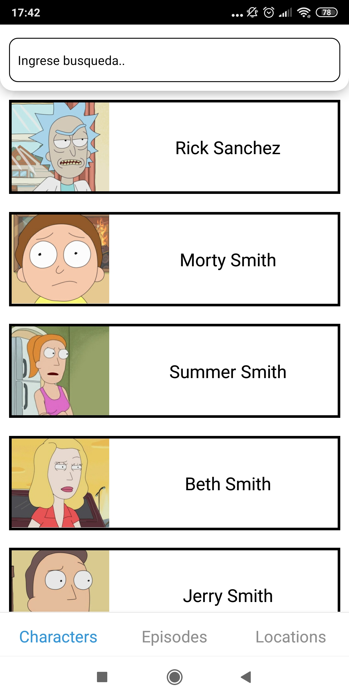
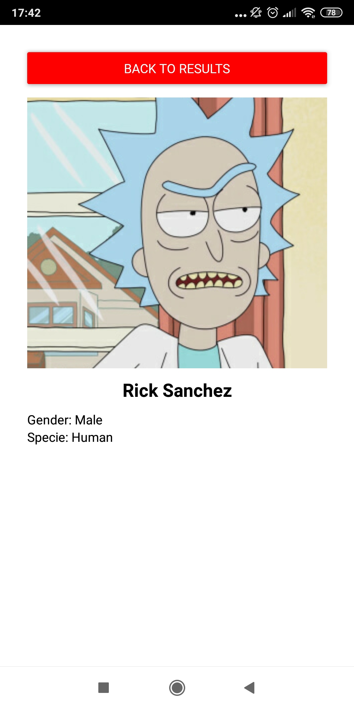
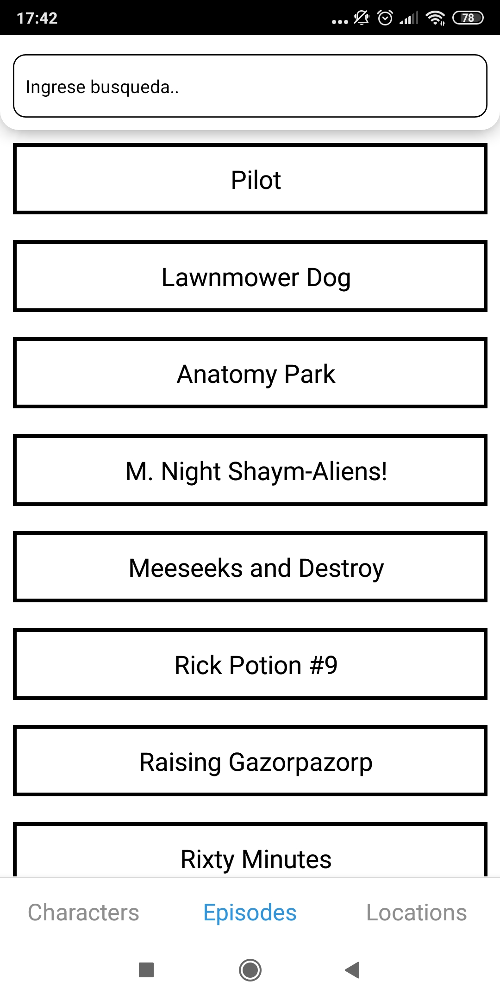
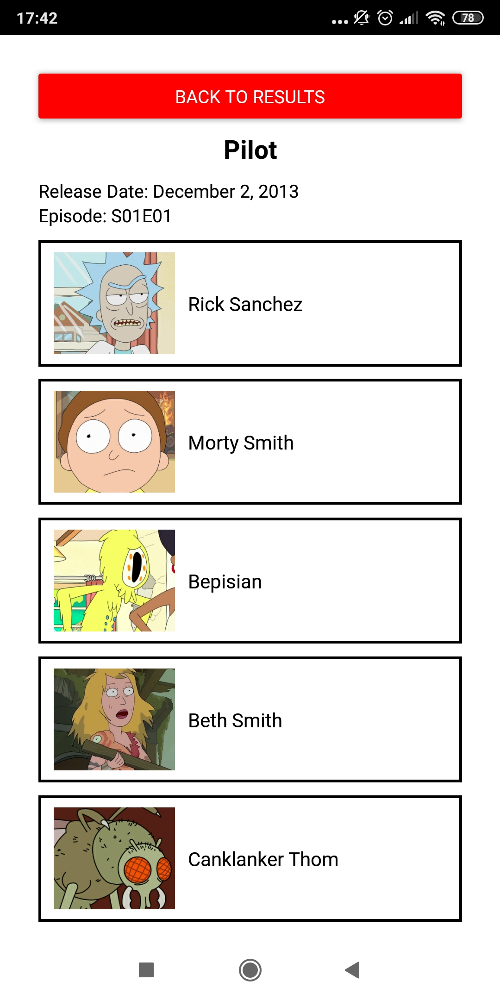
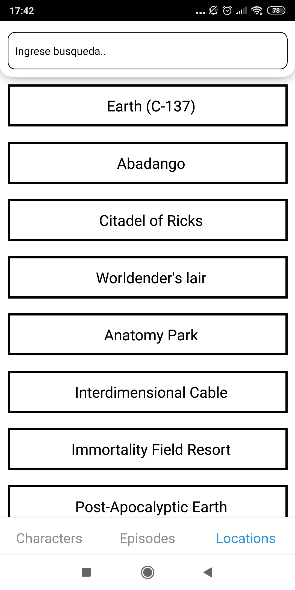
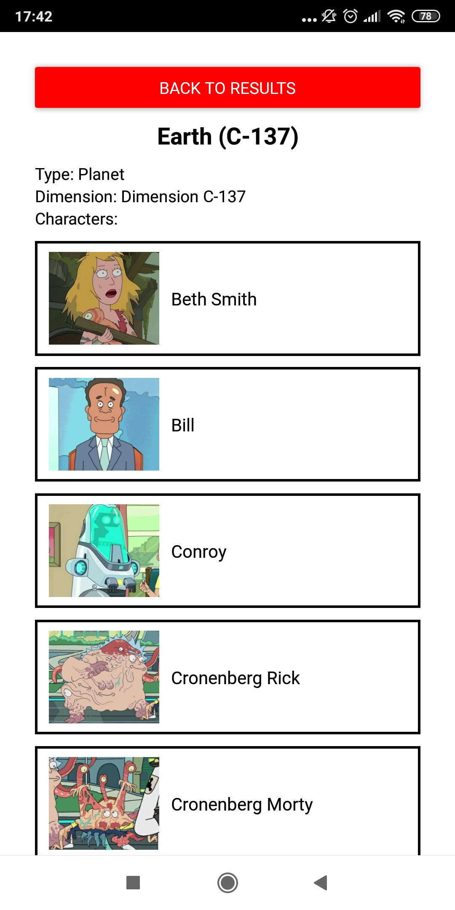

# Rick & Morty App Challenge 

---

### Is an app to obtain different information about Rick & Morty's serie like Characters, episodes or differents locations

---

## Tecnologies

- [Node (v12.18.4)](https://nodejs.org/en/)

- [React Native (v0.63)](https://reactnative.dev/docs/getting-started)

- [TypeScript (v4.0)](https://www.typescriptlang.org/download)

- [Apollo Client (v3)](https://www.apollographql.com/docs/react/get-started/)

- [Graphql (v15.3)](https://graphql.org/code/)

## Instructions

Ensure to have Node install in your system and add it into your local variables. And run the following lines in your console:

``` npm install  ```

``` npm start ```

A web browser should open allowing you to test the application directly in your browser or your mobile device

## Screenshots

### Characters


---

---

### Episodes


---

---

### Locations


---

---

